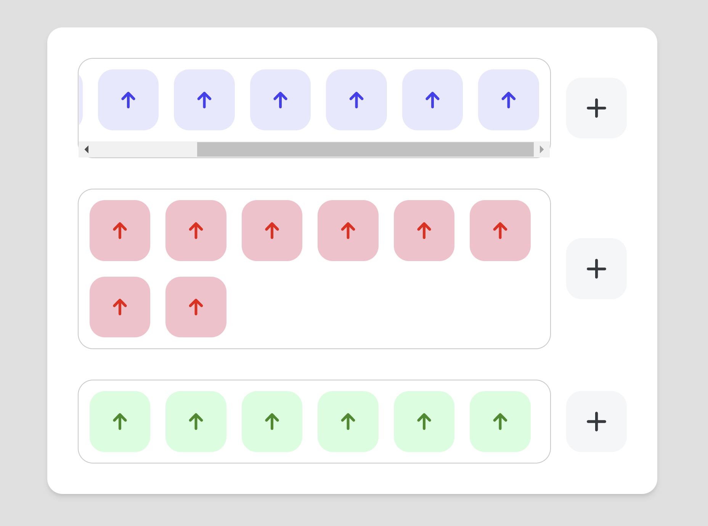

<div align="center">
  <h3 align="center">Technical Project v1 - Scrawlr</h3>

  <p align="center">
     Upvote component built with Vue 3, Vite, and Vuex 
    <br />
    <br />
    <a href="https://upvote-component-scrawlr.netlify.app/">View Demo</a>
  </p>
</div>

<!-- ABOUT THE PROJECT -->

## About The Project



The objective of this project is to build an Upvote component where the two states (selected and non-selected) are controlled globally using Vuex-store. Upvote items(up icon) can be added by clicking the plus icon, and the component itself can be clicked to toggle the state of being selected and change colour.

### Built With

- [Vue.js](https://vuejs.org/)
- [Vite.js](https://vitejs.dev/)
- [Vuex](https://vuex.vuejs.org/)

## Getting Started

### Prerequisites

- npm
  ```sh
  npm install npm@latest -g
  ```

### Installation

1. Clone the repo
   ```sh
   git clone https://github.com/yjcyun/technical-project-1.git
   ```
2. Install NPM packages
   ```sh
   npm install
   ```
3. Start the development
   ```js
   npm run dev
   ```
